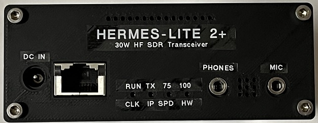
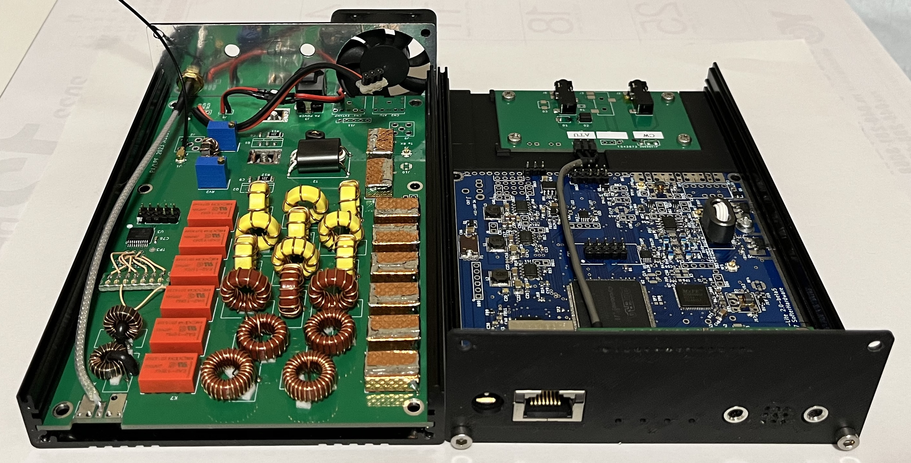

# PA30 - 30W amplifier/filter companion board for Hermes Lite 2+ / 2

## All board, Hermes Lite 2 beta5, AK4951 companion board v3 and PA30 companion board v1, are installed in Makerfabs 40mm height enclosure.

### Exterior view

### Interior view (PA30 ver1 board)
  

### Feature
- RD15HVF1 push-pull 30W linear amplifier.
- A retired notebook AC adaptor is used to supply 19.5V to RD15HVF1.
- Tx/Rx LPF and Rx HPF ; same control as N2ADR filter
- FWD/REV sensor ; Alex type
- Tx RF feedback path for PureSignal.
- Phones and Mic Jacks are placed on the front panel, and CW key jack on the rear.

### Test result
- [_Tx Power with comparison of RD15HVF1s and RD16HHF1s_](Doc/PowerMeter/RD15_RD16_comparison_on_PA30.jpg)  
  Tx power is lower if RD16s is used instead of RD15s.
- [_Thetis FWD Power Meter_](Doc/PowerMeter/Test_FwdMeter_40M_CW.jpg)
- Spur at 30W [_160M_](Doc/Spur/Spur_160M_30W.jpg) , [_80M_](Doc/Spur/Spur_80M_30W.jpg) , [_40M_](Doc/Spur/Spur_40M_30W.jpg) , [_20M_](Doc/Spur/Spur_20M_30W.jpg) , [_15M_](Doc/Spur/Spur_15M_30W.jpg)
- PureSignal at 30W [_ON_](Doc/PureSignal/IMD_40M_30W_PS-ON.jpg), [_OFF_](Doc/PureSignal/IMD_40M_30W_PS-OFF.jpg)

### Latest design files ver2.1
There are some errata on my 1st design (v1). Schematic and pcb layout have been revised to fix them. There is no DRC error on KiCad but these are not actually build and verified.
- [_Schematic_](Schematic/PA30_v2r1_schematic.pdf)
- [_BOM_](BOM/PA30_BOM.pdf)
- [_Gerber_](Gerber/PA30_v2r1.zip)

### PA30 Assembly
- Trans and coil  
    [_T1_](Doc/Assemble/T1_bifilar_12turns.jpg) , [_T2_](Doc/Assemble/T2_4turns_1turnx2.jpg) , [_L1_](Doc/Assemble/L1_1turn.jpg)  
    T3, T4 : UEW 0.32mm  
    LPF 160M, 80M : UEW 0.5mm  
    LPF 40M, 30/20M, 17/15M, 12/10M : UEW 0.6mm
- RD15HVF1 grounding  
    It's necessary to connect RD15HVF1 source tab to GND pattern of PCB  shortly. Otherwise amplifier will not work well. eg. lower power output... Copper tape is used. ( [_Photo_](Doc/Assemble/RD15Tab.jpg) )   
- RD15HVF1 idle current  
    Q1, Q2 idle current is set to 250mA per Tr (total 500mA).

### HL2 modification
- Reduce HL2 RF output power to avoid over drive ; 37dBm -> 26dBm  
    R55 : Replace 120ohms with 750ohms. Otherwise Q1 and Q2 will be broken.

- uFL Tx output  
    RF7 and B55 : Install  
    B98 : Uninstall

- uFL Rx input  
    RF5 : Install  
    B81 : Uninstall

- CW KEY jack  
    Jack(CN4) and jumper(J13) : Uninstall to get clearance to jacks on CBV3.  ( [_Photo_](Doc/Assemble/CN4_1.jpg) )   
    Instead of the uninstalled jack CN4, 3.5mm jack is placed on rear panel. ( [_Photo_](Doc/Assemble/CN4_2.jpg) )  
    Wire is used to connect between PCB and the jack.

- Pin Header  
    Low profile pin header and socket are used.   ( [_Photo_](Doc/Assemble/LowProfilePinHeader.jpg) )  
    CN1, DB1, DB12, DB13, DB7 Pin12-14 ( [_Photo_](Doc/Assemble/HL2_PinHeader.jpg) )

### AK4951 CBV3 modification  
- [_Stacked boards Photo_](Doc/Assemble/stacked_boards.jpg)
- Mic/PTT jack and Phone jack  
    They are relocated on the opposite PCB side. ( [_Photo_](Doc/Assemble/CBV3_1.jpg) )  
    Therefore the signals assigned to Tip and Ring are swapped.   
    C3 10uF on CBV3 is removed to mount Mic/PTT jack. There is no side effect in my case.

- Pin Header  
    Low profile pin header and socket are used.   ( [_Photo_](Doc/Assemble/LowProfilePinHeader.jpg) )  

- Jack Spacer (option)  
    The B2B Pin Header/Socket height and jack height are different.  
    Therefore 3D printed spacer (t = 0.7mm) is used between jack and PCB to fix tightly. ( [_Photo_](Doc/Assemble/CBV3_2.jpg) )  

- CVB3 Support part (option)  
    The 3D printed support part that fixes CBV3 and HL2 tightly, is used. ( [_Photo_](Doc/Assemble/CBV3_3.jpg) ) 

### Cooling fan
- 40mm square. ( [_Photo_](Doc/Assemble/fan.jpg) )

### Shield (option)  
- This is risk hedge.  I have not verified if it's essencial or not.
- Relay shield (copper tape is used) intend to isolate LPF input and output, and to isolate Tx  and Rx. ( [_Photo_](Doc/Assemble/relay_shield.jpg) )
- 3D printed shield between HL2 and PA30  
    Aluminum tape is used. ( [_Photo_](Doc/Assemble/B2B_shield.jpg) )

### 3D print files
- [_Jack spacer_](3D_Print/jack_3r5_spacer%20v3.stl)
- [_CBV3 support_](3D_Print/HL2_cbv3_support%20v1.stl)
- [_B2B Shield_](3D_Print/RF_shield%20v32.stl)
- [_Front Panel_](3D_Print/FrontPanel%20v1.stl)
- [_Rear Panel_](3D_Print/HL2_RearPanel2%20v4.stl)
- [_HL2 spacer instead of N2ADR board_](3D_Print/HL2_spacer3%20v5.stl)
